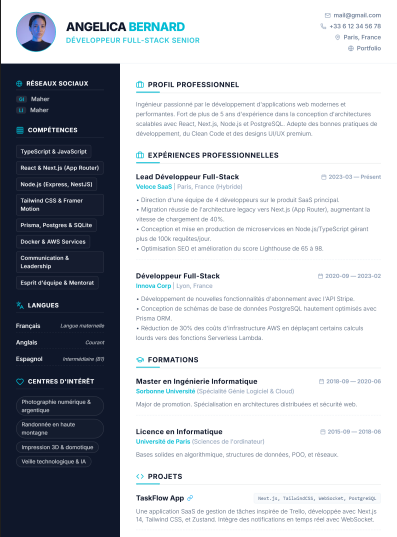
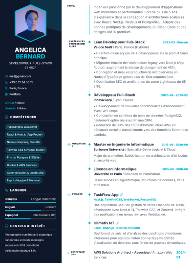
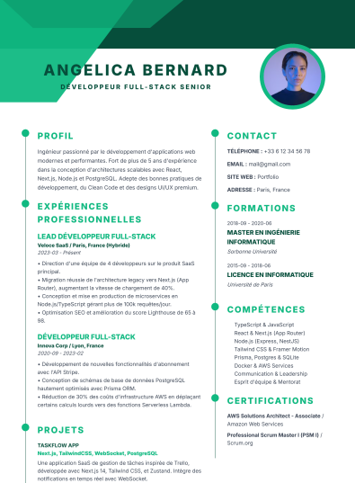
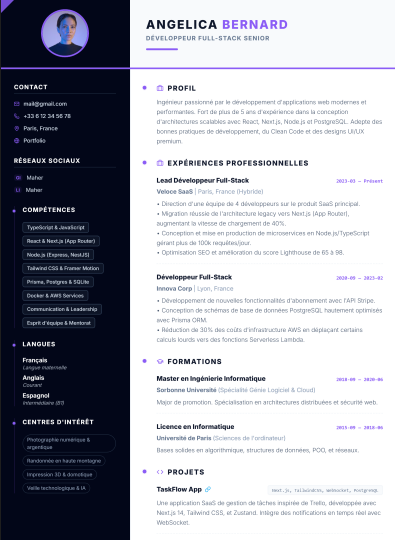

# CV.tn

Générateur de CV interactif construit avec Next.js. L’objectif du projet est de permettre de créer, personnaliser, sauvegarder et exporter des CV modernes depuis une interface unique, avec un aperçu en temps réel.

## Fonctionnalités

- Édition complète du contenu du CV : identité, résumé, expérience, formation, projets, compétences, langues, centres d’intérêt et sections personnalisées.
- Choix parmi 9 templates de CV, chacun avec une identité visuelle différente.
- Personnalisation des couleurs, de la typographie, de l’espacement et de la disposition.
- Ajout et cadrage d’une photo de profil avec optimisation automatique.
- Undo / redo, réinitialisation du CV et création d’un nouveau document vierge.
- Autosave local dans le navigateur via `localStorage`.
- Sauvegarde, chargement et suppression des CV dans une base SQLite locale via Prisma.
- Export en PDF et impression vectorielle via le navigateur.
- Interface responsive avec mode bureau, mode mobile et bascule rapide entre édition et aperçu.
- Version française et anglaise intégrée dans l’interface.

## Captures D’écran

Voici deux exemples de CV que l’on peut obtenir avec ce projet. Vous pouvez remplacer ces images par vos propres exports dans le dépôt si vous voulez montrer d’autres styles.

<p align="center">
	
	
    
        
    
</p>

## Technologies

- Next.js 16
- React 19
- TypeScript
- Tailwind CSS
- Zustand
- Prisma + SQLite
- Radix UI
- dnd-kit
- Framer Motion
- jsPDF et html2canvas-pro pour l’export PDF

## Prérequis

- Node.js 20 ou plus récent
- npm

## Installation

```bash
npm install
npx prisma generate
npx prisma db push
```

Le projet utilise une base SQLite locale. Aucun service externe n’est nécessaire pour le démarrage en local.

## Lancer Le Projet

```bash
npm run dev
```

Puis ouvrez [http://localhost:3000](http://localhost:3000).

## Comment Utiliser Le Projet

1. Ouvrez l’application dans votre navigateur.
2. Renseignez vos informations personnelles dans l’éditeur.
3. Ajoutez ou modifiez vos sections de CV selon votre profil.
4. Choisissez un template, une palette de couleurs et la typographie.
5. Ajoutez une photo de profil si besoin, puis ajustez son cadrage.
6. Vérifiez le rendu dans l’aperçu en temps réel.
7. Utilisez le bouton de téléchargement PDF ou l’impression vectorielle pour exporter votre CV.
8. Si vous voulez conserver un modèle, utilisez l’onglet de sauvegarde pour l’enregistrer dans SQLite.

## Sauvegardes Et Données

- Le projet conserve automatiquement le brouillon courant dans le navigateur.
- Les CV sauvegardés via l’onglet base de données sont stockés dans `prisma/dev.db`.
- Les routes API disponibles sont `GET /api/cv`, `POST /api/cv`, `GET /api/cv/[id]`, `PUT /api/cv/[id]` et `DELETE /api/cv/[id]`.

## Export Et Impression

- Le bouton PDF génère un export directement depuis l’aperçu.
- Le bouton d’impression utilise les styles d’impression du navigateur pour obtenir un rendu net.

## Structure Du Projet

- `src/app` : page principale et routes API.
- `src/components/editor` : panneaux d’édition du CV.
- `src/components/preview` : aperçu et export.
- `src/templates` : tous les templates de CV.
- `src/store` : état global et autosave.
- `prisma` : schéma et base SQLite locale.
